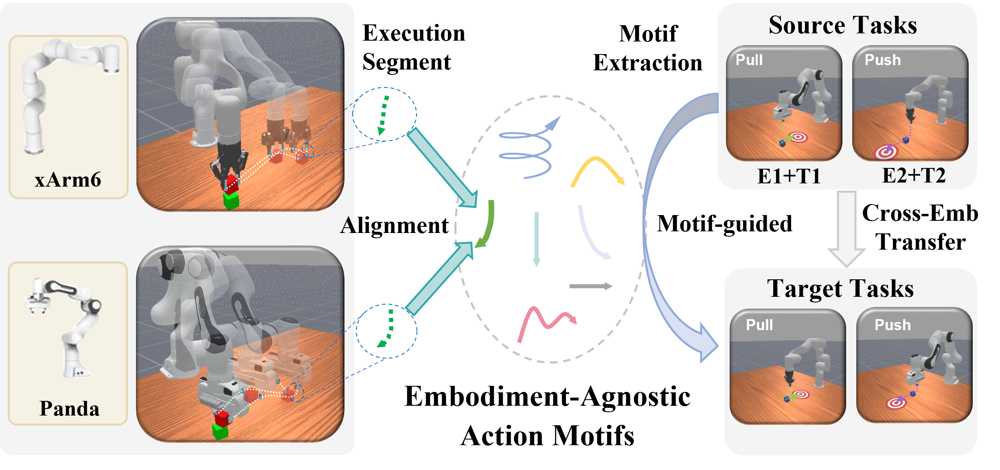
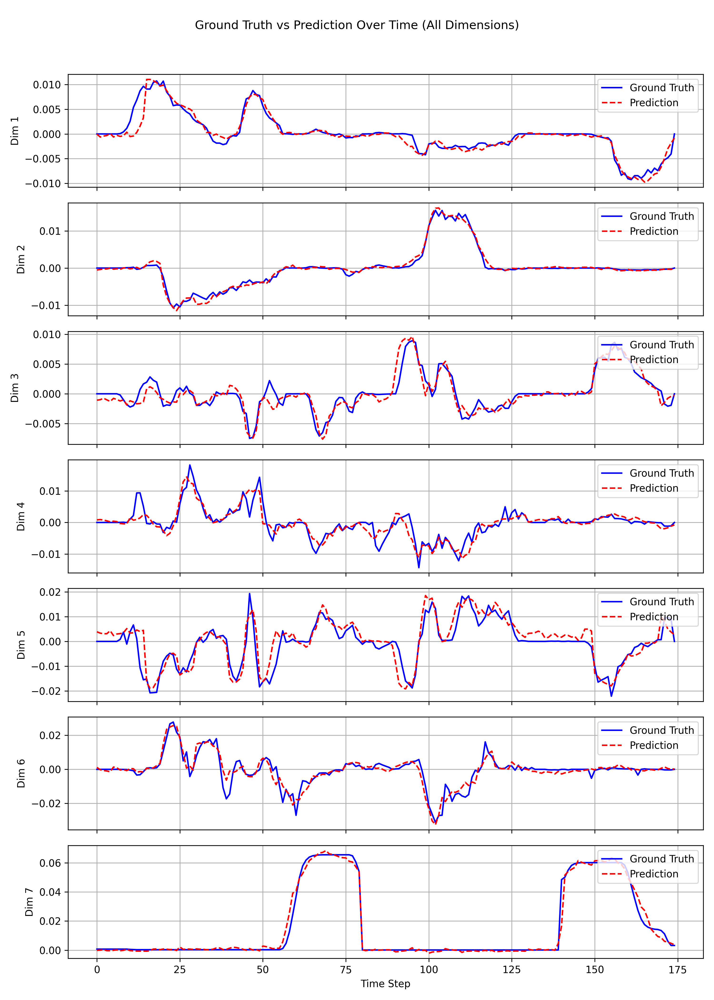

# MOTIF: Learning Action Motifs for Few-shot Cross-Embodiment Transfer

## Overview

**MOTIF** is a framework for few-shot cross-embodiment robotic transfer. It learns reusable **action motifs** that enable efficient policy generalization across different robot embodiments under limited demonstrations.

The codebase builds on and refactors from [NVIDIA/Isaac-GR00T](https://github.com/NVIDIA/Isaac-GR00T).

<div align="center">
  
</div>

---

## 🔗 Links
<!-- - 🚀 **Project Page** (Coming soon) -->
- 📄 **Paper** (Coming soon)

## ✍️ Authors
Heng Zhi, Wentao Tan, Lei Zhu, Fengling Li, Jingjing Li, Guoli Yang, Heng Tao Shen  
📧 **Primary Contact**: Heng Zhi (zhiheng@tongji.edu.cn)

---

## 🛠️ Installation

Our system configuration is as follows:
* **OS**: Ubuntu 20.04
* **GPU**: NVIDIA RTX 4090D
* **CUDA**: 12.4
* **Python**: 3.10
* **PyTorch**: 2.6

### Clone the repository
```bash
git clone https://github.com/buduz/MOTIF.git
cd MOTIF
```

### Environment setup
```bash
conda create -n motif python=3.10.16
conda activate motif

conda install ffmpeg -c conda-forge
pip install -r requirements.txt

# FlashAttention (CUDA 12.4 & PyTorch 2.6)
pip install flash_attn==2.7.4.post1 # https://github.com/Dao-AILab/flash-attention/releases/download/v2.7.4.post1/flash_attn-2.7.4.post1+cu12torch2.6cxx11abiFALSE-cp310-cp310-linux_x86_64.whl
pip install -e .
```

---

## 📂 Data Preparation

### Example Real-World Dataset
To reproduce the **interleaved task setting** described in the paper, we provide a minimal real-world dataset with demonstrations from two robot embodiments (**ARX5** and **Piper**) across two tasks.

```bash
huggingface-cli download \
  --repo-type dataset Crossingz/ARX5_Piper_Few_shot_Example \
  --local-dir ./demo_data
```

The dataset adheres to the LeRobot data format. Furthermore, we adopt the **LeRobot compatible data schema** identical to [GR00T N1](https://github.com/NVIDIA/Isaac-GR00T/tree/n1-release), which includes an additional `modality.json` for detailed modality and annotation definitions. For details, see:    [LeRobot_compatible_data_schema.md](https://github.com/NVIDIA/Isaac-GR00T/blob/n1-release/getting_started/LeRobot_compatible_data_schema.md).


### Kinematic Trajectory Canonicalization
To enable embodiment-agnostic motif learning, raw end-effector trajectories must be canonicalized into a shared reference frame anchored at the initial pose. Run the data processing script to canonicalize the trajectories:

```bash
python data/process/trajectory_canonicalization.py \
  --dataset_path ./demo_data \
  --save_path ./demo_data_processed
```

---

## 🚀 Training

### 1. Configuration
<!-- Set the dataset path in `config/dataset/dataset.yaml`

Ensure that:
- `dataset_path` points to the canonicalized dataset
- `embodiment_tag` matches the robot embodiment
- `data_config` is consistent with the dataset schema

For custom datasets, you may need to modify:
- `data/embodiment_tags.py` to add new embodiment tags
- `data/data_config.py` -->

**Step 1: Basic Configuration**

Open `config/dataset/dataset.yaml` and configure the following fields:
- `dataset_path`: Path to your **canonicalized** dataset directory.
- `embodiment_tag`: The unique identifier for your robot (must match an entry in `embodiment_tags.py`).
- `data_config`: The data configuration key (must match an entry in `data_config.py`).

**Step 2: Custom Embodiment Registration (For new embodiment)**

If you are using a custom robot (not in the provided list), you must register it in `data/embodiment_tags.py`.

1.  **Define the Tag**: Add your robot to the `EmbodimentTag` Enum.
2.  **Map to ID**: Assign an integer ID in `EMBODIMENT_TAG_MAPPING`.

> **⚠️ Critical Note**: `EMBODIMENT_TAG_MAPPING` maps the robot tag to a projector index in the Action Expert Module.
> * The ID **must not exceed 10** (0-9), as `max_num_embodiments` is set to 10.
> * Since MOTIF trains from scratch (this is not a pre-train + fine-tune paradigm), you can safely **replace/overwrite** an existing ID if you run out of slots.

**Step 3: Data Transformation Config (For new embodiment)**

Modify `data/data_config.py` to add the data configuration for your new robot. This defines how raw data (actions, states) is normalized and processed. For details on how to construct this config, please refer to the [NVIDIA GR00T Data Transforms Guide](https://github.com/NVIDIA/Isaac-GR00T/blob/n1-release/getting_started/4_deeper_understanding.md#understanding-data-transforms).

### 2. Run Training

MOTIF is trained in three hierarchical stages:

1. **Action Motif Learning**
2. **Multimodal Motif Prediction**
3. **Motif-conditioned Robotic Policy Learning**

A unified training script is provided to run all stages sequentially.

```bash
bash src/train.sh
```

---

## 📊 Evaluation

### Inference Service
We follow the deployment strategy of [GR00T](https://github.com/NVIDIA/Isaac-GR00T) and  [pi0](https://github.com/Physical-Intelligence/openpi), using a **ZeroMQ-based inference service** to decouple model inference from robot execution.

```bash
python experiment/inference_service.py \
  --model_path outputs/outputs_stage3/epoch_0060.pth \
  --port 5555
```

### Offline Evaluation
We also provide a script to simulate the evaluation pipeline on the training dataset. (ensure the `robot-uid` matches the `embodiment_tag` used during training):
```bash
python experiment/eval_policy.py \
  --port 5555 \
  --dataset-path demo_data_processed/arx5 \
  --robot-uid arx5_real_rel \
  --save-dir experiment/
```

Examples of offline inference result is shown below:
<div align="left">
  
</div>

### Real-Robot Evaluation (ARX5)

We demonstrate real-world evaluation using ARX5 as an example. The ARX5 environment is configured following the instructions provided in the [Realbot repository](https://github.com/buduz/Realbot/blob/main/README_ARX5_EN.md). We further provide a corresponding robot-side (client) script for MOTIF within the same repository.

```bash
python ./experiment/deploy_for_arx5_motif.py
```
The corresponding robot-side deployment script is also available in the [Realbot repository](https://github.com/buduz/Realbot/blob/main/deploy/deploy_for_arx5_motif.py).


---

## 🙏 Acknowledgements

This project builds upon the following open-source projects:

- [ManiSkill](https://github.com/haosulab/ManiSkill)
- [UniVLA](https://github.com/OpenDriveLab/UniVLA)
- [HPT](https://github.com/liruiw/HPT)
- [GR00T N1 / N1.5](https://github.com/NVIDIA/Isaac-GR00T)
- [LeRobot](https://github.com/huggingface/lerobot)
- [DINOv2](https://github.com/facebookresearch/dinov2)
- [T5](https://github.com/google-research/text-to-text-transfer-transformer)

---

## 📑 Citation

If you find this repository useful, please consider citing our work:

```bibtex

```
